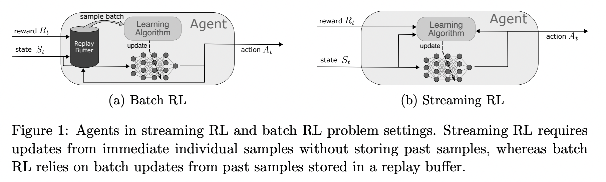

</img>

## Streaming Deep RL (wip)

Explorations into the proposed [Streaming Deep Reinforcement Learning](https://arxiv.org/abs/2410.14606), from University of Alberta

Once completed, if it checks out, will reach to integrate the Stream Q(λ) with [Q-Transformer](https://github.com/lucidrains/q-transformer)

## Citations

```bibtex
@inproceedings{Elsayed2024StreamingDR,
    title   = {Streaming Deep Reinforcement Learning Finally Works},
    author  = {Mohamed Elsayed and Gautham Vasan and A. Rupam Mahmood},
    year    = {2024},
    url     = {https://api.semanticscholar.org/CorpusID:273482696}
}
```

```bibtex
@article{Nauman2024BiggerRO,
    title   = {Bigger, Regularized, Optimistic: scaling for compute and sample-efficient continuous control},
    author  = {Michal Nauman and Mateusz Ostaszewski and Krzysztof Jankowski and Piotr Milo's and Marek Cygan},
    journal = {ArXiv},
    year    = {2024},
    volume  = {abs/2405.16158},
    url     = {https://api.semanticscholar.org/CorpusID:270063045}
}
```
