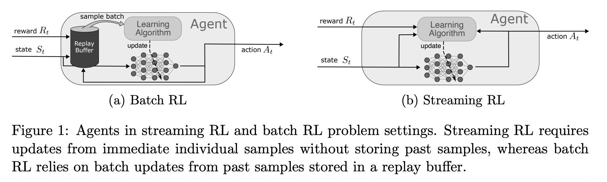

</img>

## Streaming Deep RL

Explorations into the proposed [Streaming Deep Reinforcement Learning](https://arxiv.org/abs/2410.14606), from University of Alberta.

A recent testimony to Streaming AC(λ) variant can be found [here](https://blog.9600baud.net/streaming-deep-rl-honeypot.html). Will be incorporated into the repository as well with a few improvements.

[Paper reading](https://www.youtube.com/live/5NFAzluHkcY) by Youtube AI/ML educator [@hu-po](https://www.youtube.com/@hu-po).

The official repository can be found <a href="https://github.com/mohmdelsayed/streaming-drl">here</a>.

## Install

```bash
$ pip install streaming-deep-rl
```

## Usage

```python
import torch

from streaming_deep_rl import StreamingACLambda
from x_mlps_pytorch.normed_mlp import MLP

# actor and critic

actor = MLP(
    8, 128, 128, 128,
    norm_elementwise_affine = False,
    activate_last = True
)

critic = MLP(
    8, 128, 128,
    norm_elementwise_affine = False
)

# agent

agent = StreamingACLambda(
    actor = actor,
    critic = critic,
    dim_state = 8,
    dim_actor = 128,
    num_discrete_actions = 4,
    delay_steps = 7 # 7-step TD works well for me. next step TD tends to hit a performance wall
)

# get action from state and pass to environment or world model

state = torch.randn(8)
action, action_dist = agent(state, sample = True)

# environment or world model gives back

next_state = torch.randn(8)
reward = torch.tensor(1.)
done = torch.tensor(False)

# update at each timestep, "streaming"

agent.update(
    state = state,
    action = action,
    next_state = next_state,
    reward = reward,
    is_terminal = done
)
```

## Lunar Lander

```bash
$ uv run train_lunar.py
```

## Citations

```bibtex
@inproceedings{Elsayed2024StreamingDR,
    title   = {Streaming Deep Reinforcement Learning Finally Works},
    author  = {Mohamed Elsayed and Gautham Vasan and A. Rupam Mahmood},
    year    = {2024},
    url     = {https://api.semanticscholar.org/CorpusID:273482696}
}
```

```bibtex
@article{Nauman2024BiggerRO,
    title   = {Bigger, Regularized, Optimistic: scaling for compute and sample-efficient continuous control},
    author  = {Michal Nauman and Mateusz Ostaszewski and Krzysztof Jankowski and Piotr Milo's and Marek Cygan},
    journal = {ArXiv},
    year    = {2024},
    volume  = {abs/2405.16158},
    url     = {https://api.semanticscholar.org/CorpusID:270063045}
}
```

```bibtex
@misc{daley2025averagingnstepreturnsreduces,
    title   = {Averaging $n$-step Returns Reduces Variance in Reinforcement Learning},
    author  = {Brett Daley and Martha White and Marlos C. Machado},
    year    = {2025},
    eprint  = {2402.03903},
    archivePrefix = {arXiv},
    primaryClass = {cs.LG},
    url     = {https://arxiv.org/abs/2402.03903},
}
```

```bibtex
@misc{chen2026cautiousweightdecay,
    title   = {Cautious Weight Decay},
    author  = {Lizhang Chen and Jonathan Li and Kaizhao Liang and Baiyu Su and Cong Xie and Nuo Wang Pierse and Chen Liang and Ni Lao and Qiang Liu},
    year    = {2026},
    eprint  = {2510.12402},
    archivePrefix = {arXiv},
    primaryClass = {cs.LG},
    url     = {https://arxiv.org/abs/2510.12402},
}
```

```bibtex
@misc{kumar2024maintainingplasticitycontinuallearning,
    title   = {Maintaining Plasticity in Continual Learning via Regenerative Regularization},
    author  = {Saurabh Kumar and Henrik Marklund and Benjamin Van Roy},
    year    = {2024},
    eprint  = {2308.11958},
    archivePrefix = {arXiv},
    primaryClass = {cs.LG},
    url     = {https://arxiv.org/abs/2308.11958},
}
```

```bibtex
@misc{osband2026delightfulpolicygradient,
    title   = {Delightful Policy Gradient},
    author  = {Ian Osband},
    year    = {2026},
    eprint  = {2603.14608},
    archivePrefix = {arXiv},
    primaryClass = {cs.LG},
    url     = {https://arxiv.org/abs/2603.14608},
}
```

```bibtex
@inproceedings{hendawy2026use,
    title   = {Use the Online Network If You Can: Towards Fast and Stable Reinforcement Learning},
    author  = {Ahmed Hendawy and Henrik Metternich and Th{\'e}o Vincent and Mahdi Kallel and Jan Peters and Carlo D'Eramo},
    booktitle = {The Fourteenth International Conference on Learning Representations},
    year    = {2026},
    url     = {https://openreview.net/forum?id=rFLuaG9Yq6}
}
```

```bibtex
@misc{schwarzer2021dataefficientreinforcementlearningselfpredictive,
    title   = {Data-Efficient Reinforcement Learning with Self-Predictive Representations},
    author  = {Max Schwarzer and Ankesh Anand and Rishab Goel and R Devon Hjelm and Aaron Courville and Philip Bachman},
    year    = {2021},
    eprint  = {2007.05929},
    archivePrefix = {arXiv},
    primaryClass = {cs.LG},
    url     = {https://arxiv.org/abs/2007.05929},
}
```

```bibtex
@misc{nilaksh2026squeezingstreamlearning,
    title   = {Squeezing More from the Stream : Learning Representation Online for Streaming Reinforcement Learning},
    author  = {Nilaksh and Antoine Clavaud and Mathieu Reymond and François Rivest and Sarath Chandar},
    year    = {2026},
    eprint  = {2602.09396},
    archivePrefix = {arXiv},
    primaryClass = {cs.LG},
    url     = {https://arxiv.org/abs/2602.09396},
}
```

```bibtex
@misc{maes2026leworldmodelstableendtoendjointembedding,
    title   = {LeWorldModel: Stable End-to-End Joint-Embedding Predictive Architecture from Pixels}, 
    author  = {Lucas Maes and Quentin Le Lidec and Damien Scieur and Yann LeCun and Randall Balestriero},
    year    = {2026},
    eprint  = {2603.19312},
    archivePrefix = {arXiv},
    primaryClass = {cs.LG},
    url     = {https://arxiv.org/abs/2603.19312}, 
}
```
